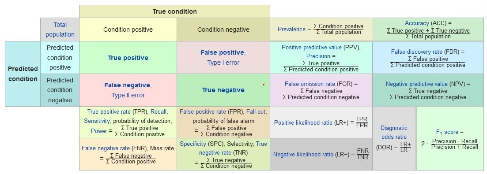

```{r setup, include=FALSE}
knitr::opts_chunk$set(echo = TRUE)
```

## Install Packages

```{r echo=TRUE, message=FALSE, warning=FALSE}

package_name = c('dplyr', 'ggplot2', 'tidyr')

for(p in package_name) {
  if(! p %in% rownames(installed.packages())){
    cat('Try to install ', p, 'now !\n')
    tryCatch({
      install.packages(p)
    }, error = function(e) {
      print(e)
      conditionMessage(e)
    })
  }else{
    cat(p, 'has been installed !\n')
  }
}

```

## Model Performance

{width=100%}

```{r message=FALSE, warning=FALSE}

model_performance <- function(predict_condition, true_condition){
  
  require(dplyr)
  require(tidyr)
  require(ggplot2)
    
  # Confusion Matrix, Contingency Table
  confusion_matrix <- table(predict_condition, true_condition)
  
  # Hit, True Positive
  TP <-  confusion_matrix[1,1]
  # Correct Rejection, True Negative
  TN <- confusion_matrix[2,2]
  # False Alarm, Type I Error, False Positive
  FP <-  confusion_matrix[1,2]
  # Miss, Type II Error, False Negative
  FN <-  confusion_matrix[2,1]
  
  
  
  # Sensitivity, Recall, True Positive Rate
  TPR <- TP / (TP + FN)
  
  # Specificity, Selectivity, True Negative Rate
  TNR <- TN / (TN + FP)
  
  # Precision, Positive Predictive Value
  PPV <- TP / (TP + FP)
  
  # Negative Prediction Value
  NPV <- TN / (TN + FN)
  
  # Miss Rate, False Negative Rate
  FNR <- FN /(FN + TP)
  
  # Fall Out, False Positive Rate
  FPR <-  FP / (FP + TN)
  
  # False Discovery Rate
  FDR <- FP / (FP + TP)
  
  # False Omission Rate
  FOR <- FN / (FN + TN)
  
  
  
  # Threat Score, Critical Success Index
  TS <- TP / (TP + FN + FP)
  
  # Accuracy
  ACC <- (TP + TN) / sum(confusion_matrix)
  
  # Balanced Accuracy, Harmonic Mean of Precision and Sensitivity
  BA <- (TPR + TNR) / 2
  
  # F1 Score
  F1 <- 2*(PPV*TPR)/(PPV+TPR)
  
  # Matthews correlation coefficient
  MCC <- (TP*TN -FP*FN) / (sqrt(TP+FP)*sqrt(TP+FN)*sqrt(TN+FP)*sqrt(TN+FN))
  
  # Bookmaker Informedness
  BM <- TPR + TNR - 1
  
  # Markedness, delta-P
  MK <- PPV + NPV - 1
  
  df = data.frame(
        TPR = TPR, 
        TNR = TNR, 
        PPV = PPV, 
        NPV = NPV, 
        FNR = FNR, 
        FPR = FPR, 
        FDR = FDR, 
        FOR = FOR, 
        TS = TS, 
        ACC = ACC, 
        BA = BA, 
        F1 = F1, 
        MCC = MCC, 
        BM = BM, 
        MK = MK
      )
  
  
  positive_measure = df[c('TPR', 'TNR', 'PPV', 'NPV', 'F1',
                          'ACC', 'TS', 'BA', "BM", 'MK')]%>% gather

  plot_positive <-  ggplot(positive_measure, 
       aes(x=reorder(key,-value),y=value,fill=key))+
        geom_bar(stat="identity")+
        # coord_polar(theta="x",direction=1)+
        labs(x="Measure",y="Performance")+
        theme(legend.position="bottom",legend.box="horizontal")+
        ggtitle(label = 'Positive Model Performance',
                subtitle = 'The higher, the better.')+
        geom_text(aes(x = reorder(key,-value),
                            y=value, 
                            label = round(value, 2)),
                  vjust = 1.2)
  
  
  negative_measure = df[c("FNR", "FPR", "FDR", "FOR")]%>% gather

  plot_negative <- ggplot(negative_measure, 
       aes(x=reorder(key,-value),y=value,fill=key))+
        geom_bar(stat="identity")+
        # coord_polar(theta="x",direction=1)+
        labs(x="Measure",y="Performance")+
        theme(legend.position="bottom",legend.box="horizontal")+
        ggtitle(label = 'Negative Model Performance',
                subtitle = 'The lower, the better.')+
        geom_text(aes(x = reorder(key,-value),
                            y=value, 
                            label = round(value, 2)),
                  vjust = 1.2)


  return(
    list(
      confusion_matrix = confusion_matrix,
      TP = TP, 
      TN = TN, 
      FP = FP, 
      FN = FN, 
      
      TPR = TPR, 
      TNR = TNR, 
      PPV = PPV, 
      NPV = NPV, 
      FNR = FNR, 
      FPR = FPR, 
      FDR = FDR, 
      FOR = FOR, 
      TS = TS, 
      ACC = ACC, 
      BA = BA, 
      F1 = F1, 
      MCC = MCC, 
      BM = BM, 
      MK = MK,
  
      df = df,
      plot_positive = plot_positive,
      plot_negative = plot_negative
    )
  )
  
}
```

```{r echo=TRUE, message=FALSE, warning=FALSE}
# Example
library(e1071)
data(HouseVotes84, package = "mlbench")
model <- naiveBayes(Class ~ ., data = HouseVotes84)

pred_NaiveBayes <- predict(model, HouseVotes84)

model_performance(pred_NaiveBayes, HouseVotes84$Class)
```


## DoParallel

```{r}

para = function(iterator, loop_function, user_combine = 'c',
                external_packages = NULL, cluster = 4){

  require(foreach)
  require(magrittr)
  require(parallel)
  require(doParallel)
  require(tcltk)
  
  
  cl = makeCluster(cluster)
  registerDoParallel(cl)
  
  getDoParWorkers()    # You may try it with doMC::registerDoMC()
  getDoParRegistered() # T/F, check if doPar is registered
  getDoParName()       # registered name of doPar
  getDoParVersion()    # version of doPar
  
  # numeric iterator is needed for calculating progress-bar
  iter_length = length(iterator)
  
  
  output <- foreach( i = 1:iter_length, 
                     .packages = c("tcltk", external_packages), 
                     .combine= user_combine) %dopar% {
      
      # Set progress-bar
      if(!exists("tkPB")){
          tkPB <- tkProgressBar("Parallel task","Here shows each output.", min=1, max=100)
      }
      
      # Temporary store each output 
      each_output = loop_function(iterator[i])
      
      # Show each output and progress
      setTkProgressBar(tkPB, i,
                       title = paste("進度估計", round(100*i/iter_length), "%"),
                       paste(iterator[i], ":", each_output)
                       ) 
      # The last object is the output to be combined.
      each_output
      
      }
  
  # close cluster
  stopImplicitCluster()
  stopCluster(cl)
  
  return(output)

}


```


```{r echo=TRUE, message=FALSE, warning=FALSE}
# Example
example_iter = rep(c('a','b'), 100)

example_function = function(x){
  if(x == 'a'){
    return(x)
  }else{
    cat('not a')
  }
}

result = para(example_iter, example_function)
```

